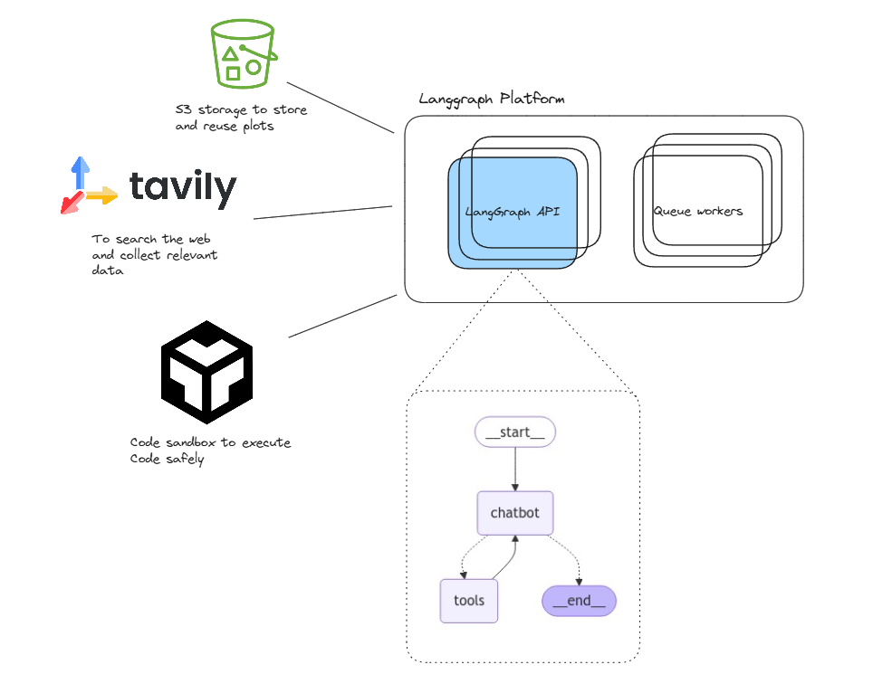
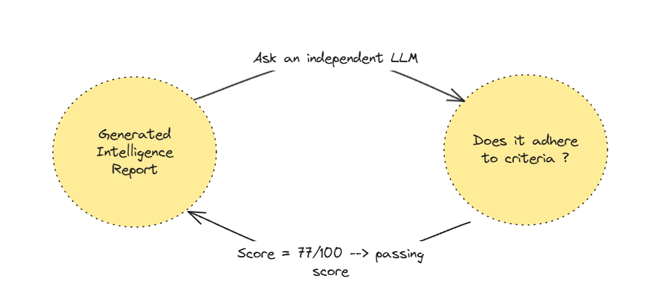
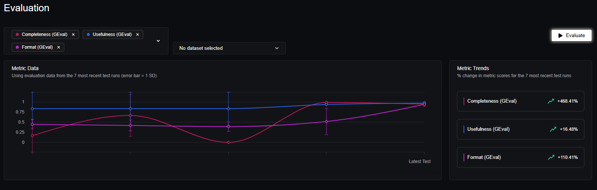
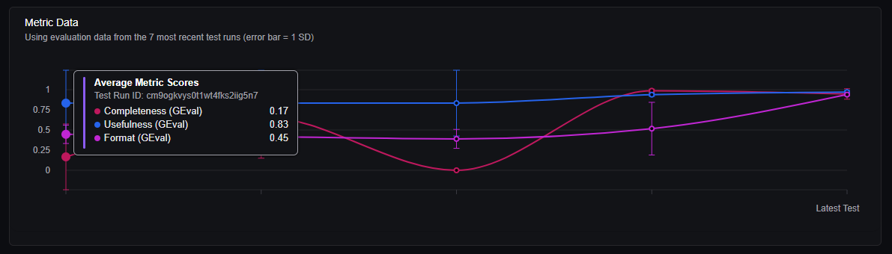
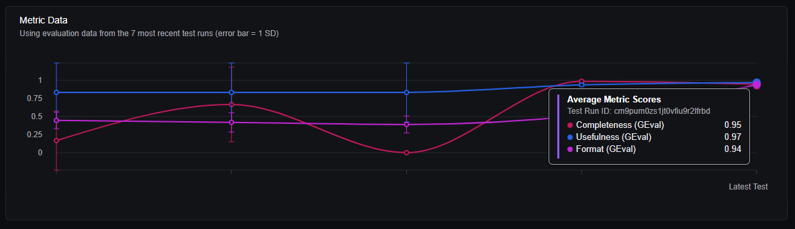

# Autonomous Industry Intelligence Report Generation Agent

## Business Scenario

Your company produces internal industry intelligence reports that help guide strategic decisions. These reports are critical for leadership to understand trends, competitors, and emerging opportunities in various markets.

Currently, the process of generating these reports involves manual research, analysis, and writing. You are tasked with designing a fully automated system that can handle this process end-to-end.

## Idea to mvp: Planning

This section will laydown the plan to arrive at an automated solution to generate industry intelligence reports.

Will also give myself the liberty to extrapolate assumptions to arrive at a working solutions when needed. :D

### Opportunity Canvas

[^1]

[^1]: [Miro board](https://miro.com/app/board/uXjVIA3jNSc=/?moveToWidget=3458764625308137392&cot=14)

### Requirements

#### Functional Requirements

1. Research and collect relevant data on a specific market or company.

2. Analyze trends, competitors, and emerging insights in the target market.

3. Generate a detailed, structured report that includes insights, competitor analysis, and strategic recommendations.

4. Delegate tasks and handle different aspects of the process like research, analysis, and report writing in a modular and scalable way.

5. The system should accept a high-level query (e.g., "Generate a strategy intelligence report for the electric vehicle market and its key players") and autonomously handle the entire process, from research to final report generation.

#### Deliverables

1. A working solution that accepts a business-level query and outputs a comprehensive industry report.

2. Clear explanation of your approach, including how the system is structured and how tasks are handled.

3. Sample output demonstrating the final report, which should include sections like market trends, competitor analysis, and strategic recommendations.

4. Documentation explaining how the system works and its workflow from input to output.

## Architecture

To meet the functional requirements above I will use one of the AI agent frameworks outthere...

Specifically I want a framework that implements the "Agentic" pattern, it needs to roughly be able to execute a loop that is can be terminated by an LLM output and should be able to provide cababilites like "tool usage" for an LLM.

It should roughly be able to implement the following diagram in either event driven, graph execution or other:

a choice of framework that can Implement the agentic pattern will align and satisfy the functional requirements

> 4. Delegate tasks and handle different aspects of the process like research, analysis, and report writing in a modular and scalable way.

### Choice of framework

My framework of choice for this project is going to be Langgraph.. there are a lot of pros to using langgraph which I am not going to delve into, and can be found in their docs [here](https://langchain-ai.github.io/langgraph/concepts/langgraph_platform/#why-use-langgraph-platform).

### Proposed Architecture

1. A graph loop that can run tools and return its results to LLM. Tools will interface with outside apis to search, execute code... etc.
2. A seach API to search the web and return search results, for this project I will be using tavilly search service.
3. A storage service to store plots and charts that will be returned in the report.
4. A sandbox environement to run python code needed to generate plots and charts.

### API Documentaion

https://langchain-ai.github.io/langgraph/cloud/reference/api/api_ref.html

## Evaluation

Data Science and AI endeavors are usually persued through iterative process of experimentaion and evaluation.

with each iteration changes are taking place to how the AI agent is prompted and the tools it uses and its configuration.

Having a rigorous way of evaluating an Agent performance with each change is essential.

### Methodology

LLM-as-a-Judge is the process of using LLMs to evaluate LLM (system) outputs. [^2]

[^2]: [confident-ai LLM as a Judge](https://www.confident-ai.com/blog/why-llm-as-a-judge-is-the-best-llm-evaluation-method#:~:text=LLM%2Das%2Da%2DJudge%20is%20the%20process%20of%20using,outputs%20of%20your%20LLM%20system.)

### Test Cases

6 test cases were used to evaluate the models:

1. > Generate a strategy intelligence report for the electric vehicle market and its key players.
   > [Example Final Generated Outcome](./agent/src/evaluation/Final_Evaluation_Run_Samples/electric%20vehicle%20market.md)
2. > Generate a strategy intelligence report for the Renewable Energy & Storage market and its key players.
   > [Example Final Generated Outcome](./agent/src/evaluation/Final_Evaluation_Run_Samples/Renewable%20Energy%20&%20Storage%20market.md)
3. > Generate a strategy intelligence report for the Artificial Intelligence (AI) & Machine Learning market and its key players.
   > [Example Final Generated Outcome](<./agent/src/evaluation/Final_Evaluation_Run_Samples/Artificial%20Intelligence%20(AI)%20&%20Machine%20Learning%20market.md>)
4. > Generate a strategy intelligence report for the Biotechnology & Healthcare Innovation market and its key players.
   > [Example Final Generated Outcome](./agent/src/evaluation/Final_Evaluation_Run_Samples/Biotechnology%20&%20Healthcare%20Innovation%20market.md)
5. > Generate a strategy intelligence report for the Space Technology & Commercial Aerospace market and its key players.
   > [Example Final Generated Outcome](./agent/src/evaluation/Final_Evaluation_Run_Samples/Space%20Technology%20&%20Commercial%20Aerospace%20market.md)
6. > Generate a strategy intelligence report for the Fintech & Blockchain market and its key players.
   > [Example Final Generated Outcome](./agent/src/evaluation/Final_Evaluation_Run_Samples/Fintech%20&%20Blockchain%20market.md)

### Criteria

LLM agent evaluation address a wide varity of problems like tool-use accuracy, retreival accuracy, hallucination and more.

The metrics used in this solution focuses on alignmet with business objective and meeting the required business function.

#### Completness

An LLM is prompted to evaluate intelligence report as follows:

> Determine if the 'actual output' contains all needed sections: 1. Market trends. 2. Competitor analysis 3. strategic recommendations

And is asked to follow the evaluation steps:

> 1.  "Check if the 'actual output' includes a 'Market trends' section and compare it to the 'input' requirements."
> 2.  "Verify that a 'Competitor analysis' section is present in the 'actual output' and evaluate its alignment with the 'input' expectations."
> 3.  "Assess whether the 'actual output' contains a 'strategic recommendations' section and ensure it meets the criteria outlined in the 'input'."
> 4.  "Confirm that all three sections ('Market trends', 'Competitor analysis', 'strategic recommendations') are adequately covered and coherent within the 'actual output'."

Then asked to give a score from 0 to 100 based on the intelligence report adherence to the criteria above.

#### Usefulness

An LLM is prompted to evaluate intelligence report as follows:

> Determine if the 'actual output' contains useful relevant insights and actionable recommendations.

And is asked to follow the evaluation steps:

> 1.  "Check if the actual output contains insights that are directly related to the input."
> 2.  "Evaluate the relevance of the insights by determining if they address key points or questions raised in the input."
> 3.  "Assess the usefulness of the insights by considering if they provide new understanding or perspectives on the input."
> 4.  "Determine if the actual output includes clear, actionable recommendations that can be directly applied to the context provided in the input."

Then asked to give a score from 0 to 100 based on the intelligence report adherence to the criteria above.

#### Format

An LLM is prompted to evaluate intelligence report as follows:

> Determine if the 'actual output' format can be presented to leadership and contains visual representaion of the insights

And is asked to follow the evaluation steps:

> 1.  "Check if the actual output format is professional and suitable for presentation to leadership."
> 2.  "Verify that the actual output includes visual representations, such as charts or graphs, to illustrate the insights."
> 3.  "Ensure that the input data supports the insights presented in the visual representations within the actual output."
> 4.  "Assess the clarity and conciseness of the insights in the actual output as they are derived from the input."

Then asked to give a score from 0 to 100 based on the intelligence report adherence to the criteria above.

### Results

Evaluation results were tracked using deepeval framework and Confident-ai platform accross the experimentation duration.

Our baseline results represented a simple agent with acces to tavily search tool had a low Completeness and Format scores:

Our final prompt optemized agent with both search and coding tool and anthropic latest model claude-3.7 was able to achieve very high results with respect to the criteria specified even when limited to only 2 search result per search query and anthropic teired rate limits

### Limitations

The results above are obtained with the following limitaions:

1. API rate limit of a maximum of 30000 token input and 20000 token output.
2. Only two search results can be returned for a single tavily invocation.

If the limitations above are lifted, an increase in the quantity of the information and its quality is expected to increase...

limitations above stifled any opportunity to expirement furthur.

## To Run API

#### Dev Mode:

1. Clone this repo.
2. `pip install -r requirements.txt `
3. `cd agent`
4. `langgraph run dev `

#### Production:

Follow langgraph [Guide](https://langchain-ai.github.io/langgraph/cloud/deployment/standalone_container/).
